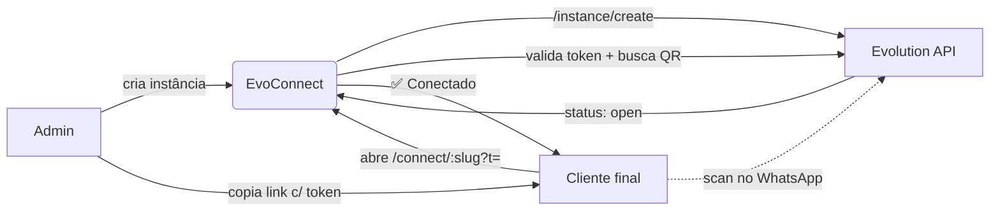

<div align="center">

# EvoConnect

**Portal white-label de autoatendimento para vincular instâncias da [Evolution API](https://evolution-api.com/).**

Crie instâncias, compartilhe um link público por cliente e deixe cada um escanear o próprio QR Code — sem nunca expor sua Global API Key.

   

</div>

---

## ✨ Funcionalidades

- **Painel Admin** — criar, excluir e acompanhar status em tempo real
- **Link público por instância** — assinado com HMAC, um por cliente
- **QR Code em tempo real** — polling a cada 4s (status) e 30s (QR)
- **Filtros por status** — Todas · Conectadas · Conectando · Desconectadas + busca por nome
- **Live Logs** — drawer flutuante com eventos do sistema
- **Mobile-first** — tela de conexão otimizada pra celular/desktop
- **Sem banco de dados** — tudo stateless; a Evolution API é a fonte da verdade

## 🧱 Stack

| Camada | Tecnologia |
|---|---|
| Frontend/Backend | [Next.js 15](https://nextjs.org/) (App Router, Turbopack) |
| Linguagem | TypeScript |
| Styling | Vanilla CSS + CSS Modules + styled-jsx (Design System Mavik) |
| Data fetching | [SWR](https://swr.vercel.app/) (polling) |
| Ícones | [Lucide React](https://lucide.dev/) |
| API | [Evolution API v2.3.7](https://evolution-api.com/) |

## 🚀 Como rodar

### 1. Clonar

```bash
git clone https://github.com/mavik-ai/EvoConnect.git
cd EvoConnect
npm install
```

### 2. Configurar ambiente

```bash
cp .env.example .env.local
```

Preencha o `.env.local`:

| Variável | Obrigatória | Descrição |
|---|:-:|---|
| `EVO_URL` | ✅ | URL da sua Evolution API (sem barra no fim) |
| `EVO_GLOBAL_KEY` | ✅ | Global API Key da Evolution |
| `ADMIN_PASSWORD` | ✅ | Senha do painel `/admin` |
| `SESSION_SECRET` | ✅ | Segredo pra assinar sessões e links (ver abaixo) |
| `NEXT_PUBLIC_SITE_URL` | ⭕ | URL pública (só pra docs) |

**Gere o `SESSION_SECRET` com segurança:**

```bash
node -e "console.log(require('crypto').randomBytes(32).toString('base64url'))"
```

> O valor nunca deve ir pra chat, email, commit ou prints. Cole direto no `.env.local` / Vercel.

### 3. Rodar

```bash
npm run dev
```

Acesse `http://localhost:3000/admin`.

## ☁️ Deploy na Vercel

1. Suba o repo no GitHub
2. Em [vercel.com](https://vercel.com) → **Add New** → **Project** → importe o repo
3. Expanda **Environment Variables** e cadastre as 4 obrigatórias:
   - `EVO_URL`
   - `EVO_GLOBAL_KEY`
   - `ADMIN_PASSWORD`
   - `SESSION_SECRET`
4. Clique em **Deploy**

> ⚠️ Em produção, sem `SESSION_SECRET` ou `ADMIN_PASSWORD` configurados, o login é recusado intencionalmente.

## 🔐 Modelo de segurança

| Vetor | Proteção |
|---|---|
| Bypass de sessão por cookie forjado | Cookie assinado via `HMAC-SHA256` (`crypto.timingSafeEqual`) |
| Captura do QR por enumeração de nomes | Link público exige `?t=<token>` (HMAC determinístico da instância) |
| Timing attack na senha | Comparação em tempo constante |
| CSRF / downgrade HTTP | `sameSite=lax` + `secure` em produção |
| Vazamento da Global Key | Todas as chamadas à Evolution são server-side; key nunca vai ao browser |
| Input malicioso em `name` | Regex estrita: `^[a-z0-9-]{2,64}$` |

Auditoria completa e threat model no commit [`2947f70`](../../commit/2947f70).

## 📂 Estrutura

```
src/
├── app/
│   ├── admin/              # Painel administrativo (protegido)
│   ├── connect/[slug]/     # Página pública de conexão do cliente
│   └── api/                # Rotas server-side (auth, instances, connect, logs)
├── components/ui/          # Componentes do Design System Mavik
├── lib/
│   ├── auth.ts             # HMAC + verificação de sessão e tokens
│   ├── evolution.ts        # Cliente Evolution API
│   └── logger.ts           # Live logs in-memory
└── styles/                 # Tokens e tema escuro
```

## 🧭 Fluxo de uso



## 📜 Licença

MIT — use, forke, venda. Só não remova a atribuição abaixo se for útil no seu fork 💚

---

<div align="center">

🧠 Desenvolvido por **[Mavik.ai Solutions](https://mavik.ai)**

Instagram: [@mavik.ai](https://instagram.com/mavik.ai) · [@rafaeljorgebr](https://instagram.com/rafaeljorgebr)

<sub>Open source for WhatsApp automation done right.</sub>

</div>
